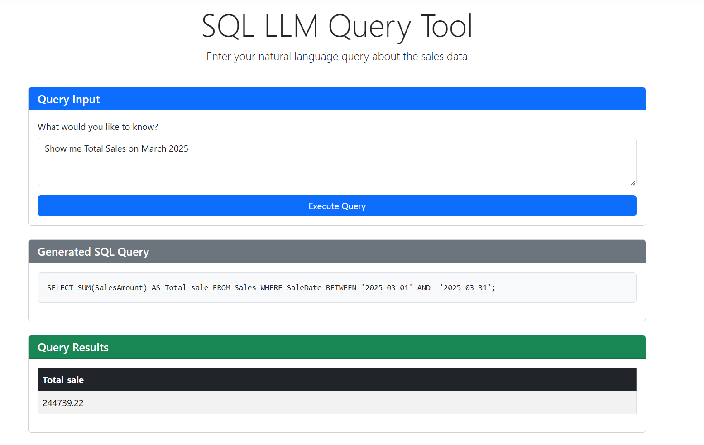

# SQL LLM - Natural Language to SQL Query Converter

A powerful ASP.NET Core web application that allows users to query SQL Server databases using natural language. SQL LLM leverages a local Large Language Model (LLM) to translate natural language questions into valid SQL queries.



## Features

- 🔍 **Natural Language Interface**: Query your database using plain English
- 🔒 **SQL Injection Prevention**: Built-in validation to ensure queries are safe
- 📊 **Interactive Results**: View query results in a clean tabular format
- 🤖 **Local LLM Integration**: Works with local LLMs like Ollama, DeepSeek, or LLaMA
- 🛠️ **Database Schema Awareness**: Provides schema context to the LLM for better results
- 📱 **Responsive Design**: Works on desktop and mobile devices

## Technology Stack

- **Backend**: ASP.NET Core 9 MVC
- **Database**: SQL Server with Entity Framework Core
- **LLM Integration**: HTTP API connectivity to local LLM
- **Frontend**: Bootstrap 5, jQuery
- **Security**: SQL query validation and sanitization

## Prerequisites

- [.NET 9 SDK](https://dotnet.microsoft.com/download/dotnet/9.0)
- SQL Server (Local or Express edition)
- A local LLM API server (e.g., [Ollama](https://ollama.ai/), [LocalAI](https://github.com/go-skynet/LocalAI))

## Installation

1. Clone the repository:
   ```bash
   git clone https://github.com/MohammadJavadDev/SQL-LLM.git
   cd SQL-LLM
   ```

2. Install required .NET tools:
   ```bash
   dotnet tool install --global dotnet-ef
   ```

3. Restore dependencies:
   ```bash
   dotnet restore
   ```

4. Update the connection string in `appsettings.json` to point to your SQL Server:
   ```json
   "ConnectionStrings": {
     "DefaultConnection": "Server=localhost\\SQLEXPRESS;Database=SQLLLM;Trusted_Connection=True;MultipleActiveResultSets=true;TrustServerCertificate=True"
   }
   ```

5. Run database migrations:
   ```bash
   dotnet ef database update
   ```

6. Build and run the application:
   ```bash
   dotnet build
   dotnet run
   ```

7. Navigate to `https://localhost:5001` in your browser.

## Configuration

### LLM Configuration

By default, the application connects to a local LLM API at `http://localhost:11434/api/generate`. You can modify this in the `LlmService.cs` file.

```csharp
// SQLLLM/Services/LlmService.cs
private readonly string _llmEndpoint = "http://localhost:11434/api/generate";
```

You can also change the model name used in the API request:

```csharp
var request = new
{
    model = "deepseek-coder", // Change to your model name
    // Other parameters...
};
```

### Database Seeding

The application includes sample data for testing purposes. This data is automatically seeded when you first run the application. You can modify the seed data in `SQLLLM/Data/SeedData.cs`.

## Usage

1. Start the application and navigate to the main page.
2. Enter a natural language query about sales data in the text area.
   - Example: "Show me total sales by region for March 2025"
   - Example: "What were the highest sales in the East region?"
   - Example: "Compare sales between regions for Q1 2025"
3. Click "Execute Query" to process your request.
4. View the generated SQL query and the results table.

## Architecture

### Component Structure

- **Data Layer**:
  - Entity Framework Core DbContext
  - Sales entity model
  - Database migrations

- **Service Layer**:
  - LLM service for natural language to SQL conversion
  - SQL service for safe query execution
  - Query validation and security

- **Presentation Layer**:
  - MVC controllers for handling user requests
  - Razor views for displaying UI
  - ViewModels for data transfer

### Process Flow

1. User submits a natural language query
2. The application sends the query and database schema to the local LLM
3. The LLM generates a SQL query
4. The application validates the SQL query for safety
5. The validated query is executed against the SQL database
6. Results are displayed to the user

## Security Considerations

This application implements several security measures:

- **Input Validation**: All user inputs are validated before processing
- **SQL Sanitization**: Generated SQL queries are validated to prevent SQL injection
- **Query Restrictions**: Only SELECT statements are allowed to prevent data modification
- **Error Handling**: Exceptions are caught and logged without exposing sensitive information

## Contributing

Contributions are welcome! Please feel free to submit a Pull Request.

1. Fork the repository
2. Create your feature branch (`git checkout -b feature/amazing-feature`)
3. Commit your changes (`git commit -m 'Add some amazing feature'`)
4. Push to the branch (`git push origin feature/amazing-feature`)
5. Open a Pull Request

## License

This project is licensed under the MIT License - see the LICENSE file for details.

---

Built with ❤️ using ASP.NET Core and LLM technology